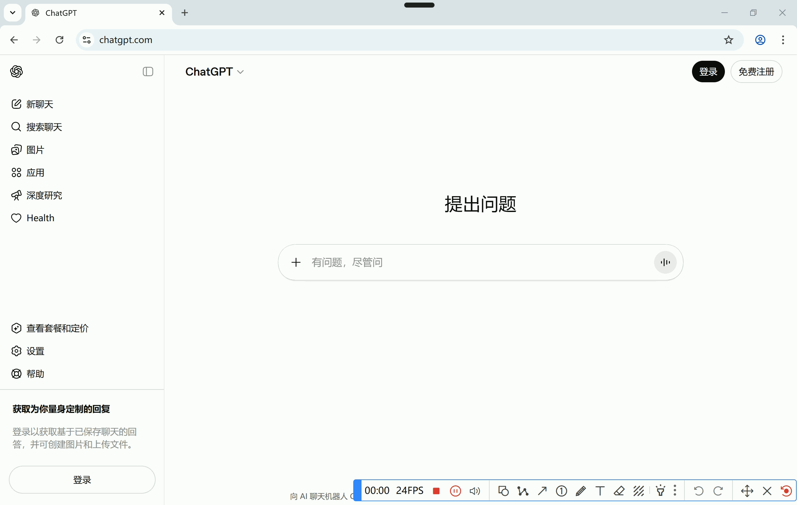
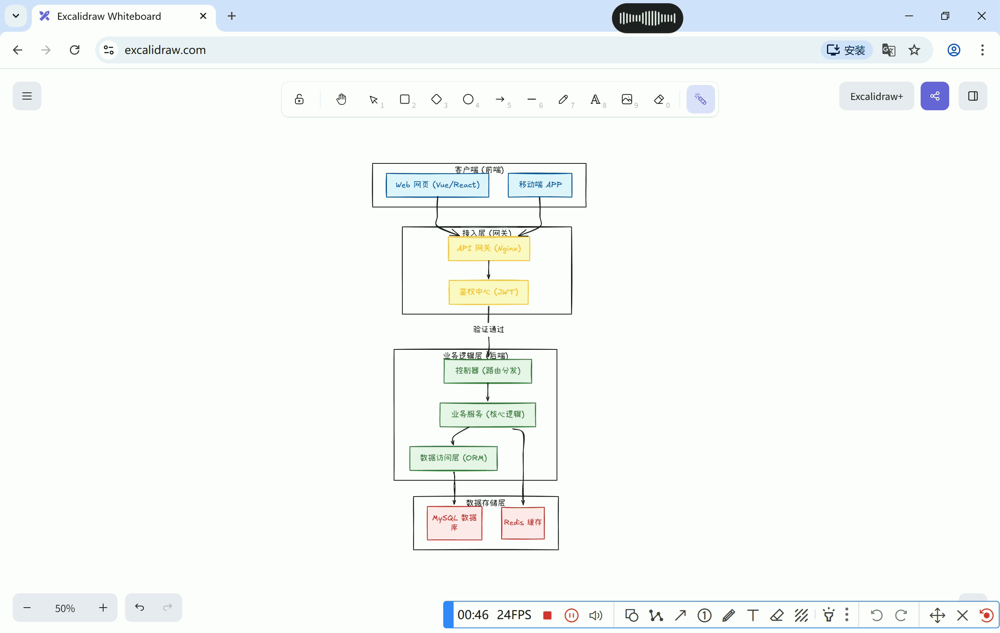
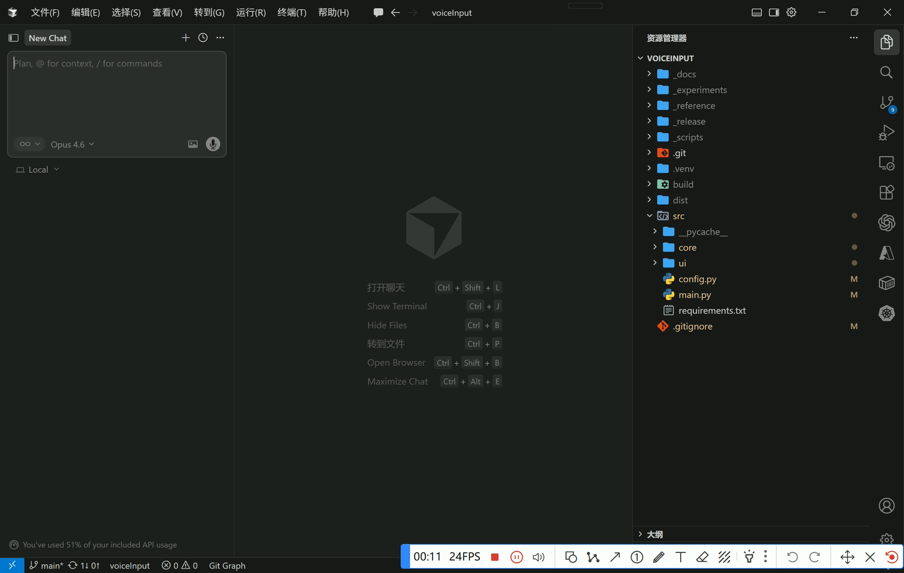

# VoiceInput ⌨️🎙️

[](https://github.com/myuan19/voiceInput/stargazers)
[](https://github.com/myuan19/voiceInput/releases/latest)
[](https://github.com/myuan19/voiceInput/releases)
[](LICENSE)
[]()
[]()

Windows 上的 AI 语音输入工具 —— 按下快捷键，说话即输入。代替键盘输入，解放双手，原本5min才能梳理清楚的需求，现在30s一步到位直达输入框。

> 基于阿里云 DashScope（通义千问 ASR），延迟低、识别准，免费额度足够日常使用。

## 💡 核心价值

本工具旨在实现与 AI 的自然交互：用户可通过日常语言自由表达自己的想法；AI 会自动将语音内容转化为清晰、可读的需求描述，并直接填入输入框。这才是本工具的根本目标——代替键盘的主要交互手段，让用户摆脱打字限制，实现无拘束、高效率的表达。

## ✨ 特性

- **全局快捷键** — 任意应用中按 `Ctrl+Shift+R`（可改）开始/停止录音，自动输入文字到光标处，同时加入剪切板。
- **智能润色** — 可选 LLM 润色（qwen-plus），修正口语、补标点、去语气词、整理口语化的需求内容。
- **顶部悬浮指示器** — 极简 mini 条，悬停水滴式展开；录音时波形与停止按钮；**长按停止按钮可作废本条**，短按仍为正常结束
- **系统托盘** — 切换模式、快捷键、API Key、麦克风；查看历史与日志目录
- **稳健体验** — 单实例防重复启动；未配置 Key 时引导配置；麦克风不可用时持续提示；转录进行中屏蔽重复触发
- **音效反馈** — 开始 / 停止 / 完成提示音

## 🎬 演示

|   | 说明 | 演示 |
|:-:|------|:----:|
| demo1 | 日常可用作语音输入工具：聊天回复、搜资料、写文档 |  |
| demo2 | 推荐的工作流程：开启录音，一边说一边梳理项目架构，然后按下快捷键结束，直接把需求粘贴到对话框 |  |
| demo3 | 用于代替 Cursor 只支持英文的语音输入 |  |

## 🚀 快速开始

1. 前往 [Releases](https://github.com/myuan19/voiceInput/releases) 下载最新发行包（便携压缩包或单文件，以 Release 页面说明为准）
2. 解压或运行后，右键托盘图标进入 **API Key**，填入 DashScope Key
   [获取 API Key](https://bailian.console.aliyun.com/cn-beijing/?tab=model#/api-key)

```bash
git clone https://github.com/myuan19/voiceInput.git
cd voiceInput
uv .venv
.venv\Scripts\activate
uv pip install -r src/requirements.txt
set DASHSCOPE_API_KEY=sk-xxxxxxxx
python -u src\main.py
```

## 📖 使用说明

| 操作           | 说明                                                            |
| -------------- | --------------------------------------------------------------- |
| 默认快捷键     | 开始/停止录音（可在托盘菜单中修改）                             |
| 左键托盘图标   | 开始/停止录音（可在配置中关闭）                                 |
| 右键托盘图标   | 菜单：模式、设备、快捷键、Key、重置指示器位置、历史、日志、退出 |
| 悬停顶部指示器 | 展开面板：录音、润色开关、是否弹出原文                          |
| 录音中         | 短按停止键 — 结束并识别；长按至环形走完 — 作废本条            |

**模式**

- **纯转录** — 语音直接转文字
- **智能润色** — ASR 后再经 LLM 润色

## ⚙️ 配置

配置文件：`%USERPROFILE%\.voiceinput\config.json`（首次运行自动生成）。

| 配置项                   | 说明                                 | 默认值               |
| ------------------------ | ------------------------------------ | -------------------- |
| `hotkey`               | 全局快捷键                           | `ctrl+shift+r`     |
| `trigger_mode`         | 触发模式                             | `toggle`           |
| `mode`                 | `transcribe` / `polish`          | `transcribe`       |
| `custom_prompt`        | 自定义润色提示（预留）               | 空                   |
| `language`             | 语言                                 | `auto`             |
| `api_key`              | DashScope API Key                    | 空（可用环境变量）   |
| `api_base_url`         | API 基地址                           | 官方默认             |
| `asr_model`            | ASR 模型                             | `qwen3-asr-flash`  |
| `mic_index`            | 麦克风设备索引                       | `null`（默认设备） |
| `paste_result`         | 识别后粘贴到光标                     | `true`             |
| `restore_clipboard`    | 粘贴后还原剪贴板                     | `false`            |
| `simulate_keypresses`  | 模拟按键（预留）                     | `false`            |
| `tray_click_to_record` | 托盘左键即录音                       | `true`             |
| `play_sounds`          | 音效                                 | `true`             |
| `save_history`         | 保存历史                             | `true`             |
| `save_audio`           | 是否保存每条原始录音                 | `false`            |
| `mini_window_x`        | 指示器水平锚点（像素，可清空以重置） | `null`             |

环境变量 `DASHSCOPE_API_KEY` 可与配置文件同时使用（配置中为空时会尝试读取）。

日志目录：`%USERPROFILE%\.voiceinput\logs\`（每次启动一个新文件，包含从启动到退出的完整记录，含 WARNING / ERROR 等）。

## 🗂️ 项目结构

```
src/
├── main.py              # 入口（单实例）
├── config.py
├── core/
│   ├── engine.py        # 录音 / ASR / 润色 / 注入
│   ├── recorder.py
│   ├── asr.py
│   ├── polisher.py
│   ├── injector.py
│   ├── history.py
│   └── log.py
└── ui/
    ├── tray.py
    ├── mini_window.py
    ├── waveform_widget.py
    ├── icons.py
    ├── sounds.py
    └── theme.py
```

## 🛠 技术栈

- Python 3.12 + PyQt6
- DashScope SDK（ASR / LLM）
- PyAudio、pynput、NumPy、loguru

## ⭐ Star History

[](https://star-history.com/#myuan19/voiceInput&Date)

## 📄 License

项目遵循 [MIT](LICENSE)
